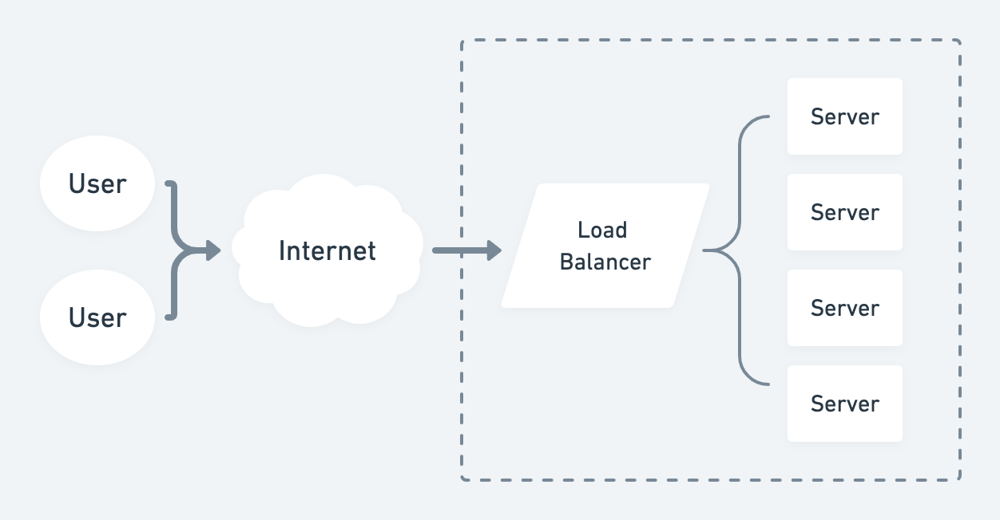

# Load Balancer Project

## Overview

This project implements a load balancer that distributes requests among multiple backend servers using different load balancing strategies. It supports Round Robin and Random strategies, and it can be easily extended to support additional strategies.

## Features

- Round Robin and Random load balancing strategies.
- Dynamic addition and removal of backend servers.
- Dynamic change of strategy without stopping the service.
- Configurable retry mechanism with exponential backoff.
- REST API for managing the load balancer.

## Prerequisites

- Java 17 or higher
- Maven
- Spring Boot
- IntelliJ IDE 2023.1.6
- Windows Cmd 

## Setup Instructions

### 1. Clone the Repository

```sh
git clone https://github.com/Samyak-Singh/loadbalancer.git
cd loadbalancer
```

### 2. Build the Project
Use Maven to build the project:
```sh
mvn clean install
```
### 3. Run the Application
Start the application using Spring Boot:
```sh
mvn spring-boot:run
```
The application will start on http://localhost:8081.

Do the above steps for server1, server2, server3 to start the mock backendservers. 
```sh
mvn clean install
mvn spring-boot:run
```
The 3 servers with start on 
1. Server 1 : http://localhost:8082.
2. Server 2 : http://localhost:8083.
3. Server 3 : http://localhost:8084.


### 4. API Endpoints


- #### 1. Forward Request
    GET /loadbalancer/forward
    
    Forwards the request to the next available backend server.
    
    Response:
    
    200 OK: Request successfully forwarded to the backend server.
    500 Internal Server Error: Failed to forward request to the backend server.
    ````
    curl -X GET "http://localhost:8081/loadbalancer/forward"
    ````

- #### 2. Add Backend Server
    POST /loadbalancer/addServer
    
    Adds a new backend server.
    
    Request Body: {
  "url": "http://localhost:8085"
  }
    
    Response:
    200 OK: Server added successfully.
    ````
    curl -X POST -H "Content-Type: application/json" -d "{\"url\": \"http://localhost:8086\"}" http://localhost:8081/loadbalancer/addServer
    ````

- #### 3. Remove Backend Server
    DELETE /loadbalancer/removeServer
    
    Removes an existing backend server.
    
    Request Body:{
  "url": "http://localhost:8085"
  }
    
    Response:
    
    200 OK: Server removed successfully.
  ````
  curl -X DELETE -H "Content-Type: application/json" -d "{\"url\": \"http://localhost:8086\"}" http://localhost:8081/loadbalancer/removeServer
  ````

- #### 4. Set Load Balancing Strategy
    POST /loadbalancer/setStrategy
    
    Sets the load balancing strategy.
    
    Parameters:
    strategy: roundrobin or random

    Response:
    200 OK: Load balancing strategy set successfully.
    400 Bad Request: Invalid strategy specified.
    ````
    curl -X POST http://localhost:8081/loadbalancer/setStrategy?strategy=random
    ````

### Low-Level Design
](img.png)

#### Components

- **Client Request**: A client sends a request to the `/forward` endpoint.
- **LoadBalancerController**: Receives the request and calls `LoadBalancerService.getNextServer()`.
- **LoadBalancerService**: Uses the current load balancing strategy to select a backend server.
- **LoadBalancingStrategy**: Implements the algorithm (e.g., Round Robin or Random) to select a server from the list.
- **BackendServer**: The selected server processes the request and returns the response to the client.

#### Use of Strategy Pattern

The Strategy pattern is used to define a family of algorithms, encapsulate each one, and make them interchangeable. This pattern allows the load balancer to select different algorithms (strategies) for distributing requests without modifying the client code.
#### Low-Level Call Flow Diagram
```plaintext
+--------+        +------------------------+        +--------------------+        +--------------------+
| Client | -----> | LoadBalancerController | -----> | LoadBalancerService | -----> | BackendServer(s)   |
+--------+        +------------------------+        +--------------------+        +--------------------+
                                                    |                      |
                                                    |                      |
                                                    v                      v
                                             +-------------------+  +--------------------+
                                             | RoundRobinStrategy|  | RandomStrategy     |
                                             +-------------------+  +--------------------+

```
### High-Level Design

1. **Traffic Distribution:** Distribute incoming traffic across multiple servers using algorithms like Round Robin, Random, etc
2. **Retry Mechanism**:  Retry failed requests with exponential backoff. 
3. **Scalability:** Easily add or remove backend servers without disrupting service.
4. **Dynamic Algorithm:** Change the loadbalancing strategy easily without stopping the loadbalancer.


### 7. How to scale
The current implementation can be extended or scaled in several ways:

1.  Add More Strategies: You can add more load balancing strategies by creating more classes that implement the `LoadBalancingStrategy` interface. For example, you could create a `LeastConnectionsStrategy` that selects the server with the fewest active connections.

2.  Add More Servers: You can add more servers to the load balancer by adding more URLs to the `servers` map in the `LoadBalancer` constructor.

3.  Handle Failures: The current implementation does not handle failures. If a server goes down while processing a request, the request will fail. You could add error handling code to retry the request on a different server if the first attempt fails.

4.  Scale Horizontally: You can run multiple instances of the load balancer behind a reverse proxy to handle more traffic. The reverse proxy would distribute incoming requests among the load balancer instances, and each load balancer instance would distribute its requests among its servers.


